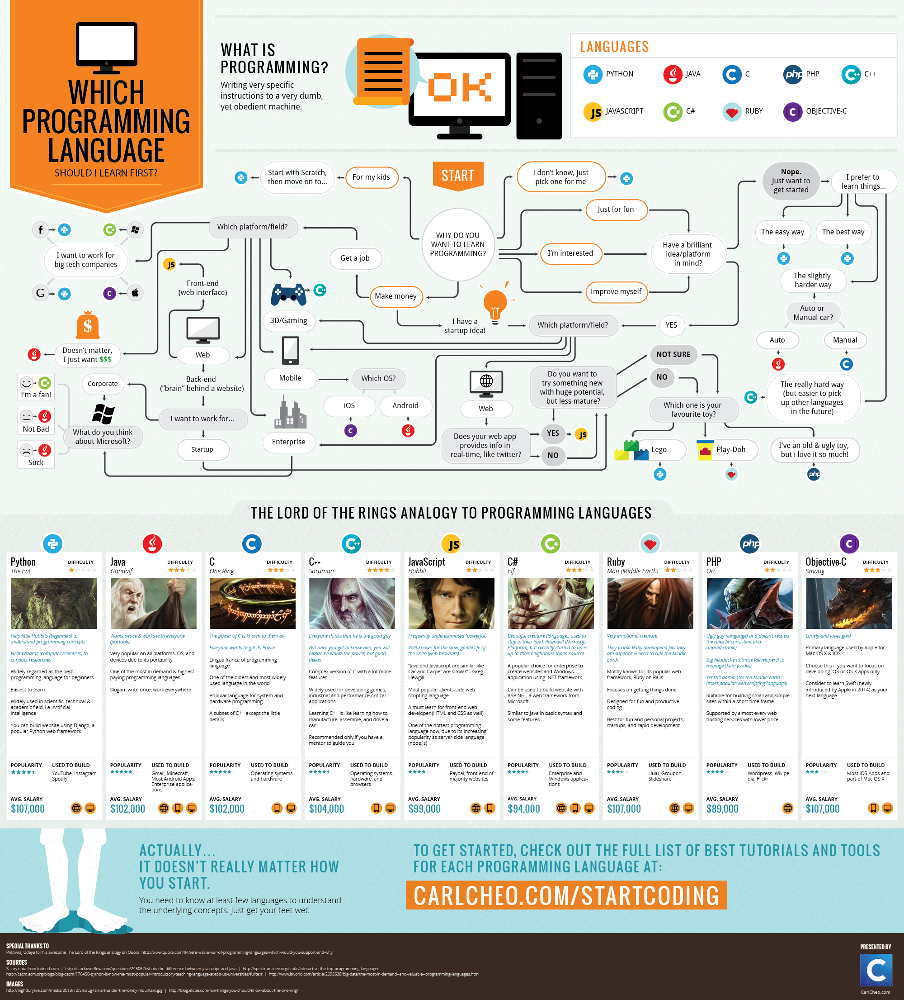

## :fa-graduation-cap: Apprendre Python

### Un programme d'apprentissage local

Lire à son rythme ces premières parties, en fonction des connaissances de chacun.
Plusieurs lectures rapides sont possibles.

1. [Découverte de Python par la console](../Python-Console/Python-Console.html)
   1. Premier lancement
   1. Une calculatrice (entiers, flottants, variables)
   1. Un peu d'anglais utile
   1. Exercices
1. [Création d'un script avec un éditeur](../Python-Editeur/Python-Editeur.html)
   1. Premier lancement
   1. Création et utilisation de fonctions
   1. Premières boucles
   1. Corriger ses erreurs
   1. Structures conditionnelles
   1. Exercices
1. [Écriture d'un carnet avec *Jupyter*](../Python-Carnets/Python-Jupyter-intro.html)
*En construction ; un peu avancé*
   1. Utilisations
   1. Cellules *Markdown*
   1. Premiers graphiques

1. [Écrire des mathématiques avec Jupyter](../Python-Carnets/Python-Jupyter-maths.html)
*En construction ; presque fini*
   1. Balises maths
   1. Nombres et les 4 opérations
   1. Calcul littéral
   1. Fractions
   1. Parenthèses
   1. Puissances
   1. Indices
   1. Écriture scripte
   1. Toujours un peu plus loin

1. [Des carnets d'exercices avec Jupyter]()
*En construction*
   1. Mathématiques - lycée
      1. Le second degré (niveau 1^ère^)
      1. La conjecture de Syracuse (niveau 1^ère^)
      1. Le crible d'Ératosthène (niveau 1^ère^)
      1. Les suites numériques (niveau 1^ère^)
      1. Les nombres de Mersenne
      1. Quelques problèmes issus de [Project Euler](https://projecteuler.net/)
   1. NSI
      1. Les nombres en binaires
      1. Les booléens
      1. Les ensembles
      1. Les dictionnaires
   1. Sciences physiques
   1. Chimie
   1. SVT
   1. Économie
   1. [Mathématiques - supérieur](https://mybinder.org/v2/gh/FranckCHAMBON/Python-Lycee/master?filepath=Carnets%2Fmaths%2FSommaire.ipynb)
      1. Un tour sur les tests de primalité
      2. Un tour sur les méthodes de factorisation
1. [Arithmétique modulaire](https://mybinder.org/v2/gh/FranckCHAMBON/L1-Math-Info---Arith/master?filepath=Sommaire.ipynb) (niveau L1 maths-info ; **avancé**)
    1. Décomposition en facteurs premiers
    1. Divisibilité dans Z
    1. Théorème de Bachet-Bézout
    1. Arithmétique modulaire
    1. Applications simples
    1. TD corrigés et évaluation
    1. [Liste complémentaire de problèmes d'algorithmique](https://www.spoj.com/problems/FRANCKY/) ; *in english*

### Autres programmes d'apprentissage possibles

Chacun ayant ses préférences en termes de style, ou d'éthique, on pourra aussi consulter d'autres références **pour débuter**.

- La [documentation officielle](https://docs.python.org/fr/3/) ; très riche. Parties 1 à 5 du tutoriel.
- Le livre [Apprendre à programmer avec Python3](https://inforef.be/swi/download/apprendre_python3_5.pdf) de Gérard Swinnen. (Chapitres 1 à 7, puis 10).
- Le livre [Une introduction à Python 3](https://perso.limsi.fr/pointal/_media/python:cours:courspython3.pdf) de Bob Cordeau & Laurent Pointal (Chapitres 1 à 5).
- Sur [Zeste de savoir](https://zestedesavoir.com/), [les bases](https://zestedesavoir.com/tutoriels/799/apprendre-a-programmer-avec-python-3/) (3h30) puis [parties avancées](https://zestedesavoir.com/tutoriels/954/notions-de-python-avancees/) (12h).
- Sur [OpenClassRoom](https://openclassrooms.com/fr/) la [partie 1](https://openclassrooms.com/fr/courses/235344-apprenez-a-programmer-en-python) du cours sur Python.
- Sur [developpez.com](https://flossmanuals.developpez.com/tutoriels/debuter/initiation-python/), un parmi [d'autres](https://python.developpez.com/cours/).

Ensuite, résoudre des exercices est le plus gros moteur de progrès. On en trouvera sur :

- [France IOI](http://france-ioi.org) ; très adapté aux élèves ; possible dès le collège.
- Sur le site tech⋅io : [Une présentation de Python au lycée très axée maths]((https://tech.io/playgrounds/17176/recueil-dexercices-pour-apprendre-python-au-lycee/presentation-2)).
  - recommandé aux élèves de maths/NSI débrouillards,
  - recommandé aux enseignants de maths débutants Python,
  - recommandé aux jeunes étudiants.
- [Prologin](https://prologin.org/) ; dans un second temps.
- [Project Euler](https://projecteuler.net/) ; en anglais. Contient certains problèmes d'une extrême difficulté. Les premiers sont abordables.
- [SPOJ](https://www.spoj.com/) ; en anglais. Contient une base colossale de problèmes, certains sont très faciles, d'autres de difficulté extrême.
- [Codin'Game](https://www.codingame.com/start) ; contient des publicités. Recommandé aux gamers qui veulent progresser. Toutes difficultés.

Enfin, chacun pourra être autonome pour compléter avec les aspects ou les modules qui l'intéresse le plus. Développement Web, sciences appliquées, algorithmique, mathématiques, ...

Voici une série d'articles récents sur [linuxfr.org](https://linuxfr.org/news/python-pour-la-rentree-2019-partie-1) pour les plus curieux sur Python.

D'autres liens en anglais en cliquant sur l'image suivante. D'abord pour tenter de répondre à la question :
> **Quel langage de programmation** apprendre en premier ?

